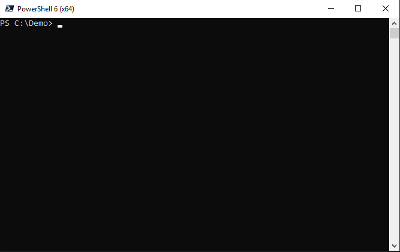

# What is Automation Easy

Automation Easy is a framework which contains a library of templates and pre-built solutions.
The goal is to make it easy for everyone to get started using various technologies.

Many aspects of IT needs to be highly customized to the different environments they are going to be leveraged in.
One such example is on- and offboarding of users, which is supported by the User Management Automation solution in Automation Easy.
In such scenarios, the solution is creating a starting point which can be built upon and customized to the specific needs of the organization it is going to be leveraged in.

Full documentation is available [here](https://automationeasy.crayon.com/)

| Dev build | Dev docs | Master build and docs |
|-----------|----------|-----------------------|
|[](https://dev.azure.com/CrayonAS/AutomationEasy/_build/latest?definitionId=4)|[](https://dev.azure.com/CrayonAS/AutomationEasy/_build/latest?definitionId=6)|[](https://dev.azure.com/CrayonAS/AutomationEasy/_build/latest?definitionId=5)|
||[Dev docs](https://automationeasydev.z6.web.core.windows.net/)|[Master docs](https://automationeasy.blob.core.windows.net/)|

## Deployment

Automation Easy leverages [Plaster](https://github.com/PowerShell/Plaster) - a template-based file and project generator written in PowerShell - for deploying solution templates.



If you have the [PowerShellGet](https://docs.microsoft.com/en-us/powershell/gallery/overview#powershellget-overviewadme) module installed (installed by default in Windows 10)
you can enter the following command:

```PowerShell
Install-Module Plaster -Scope CurrentUser
```

Alternatively you can download a ZIP file of the latest version from Plaster`s [releases](https://github.com/PowerShell/Plaster/releases)
page.

Next, download a copy of the latest Automation Easy version, either by cloning the repository or downloading a ZIP-file as described [here](https://help.github.com/articles/cloning-a-repository/).

Deploy the files with Plaster:

```Invoke-Plaster -TemplatePath .\deploy\ -DestinationPath C:\Path\To\Destination\```

.\deploy is the path to the deploy-folder in the downloaded version of Automation Easy.

For more information, see the deployment [documentation](docs/Deploy/index.md)

You now have a local folder containing the selected solutions from Automation Easy. For further instructions, read the documentation for the selected solutions.

## Contributing

Please do not push directly to the master branch. For Pull Request instructions, please see the contributing [instructions](docs/Contributing.md)
