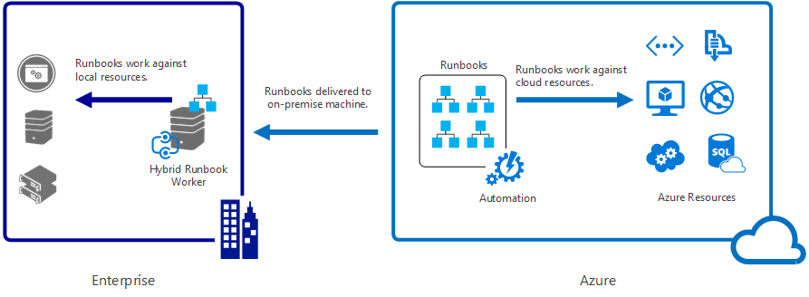

# What is Azure Automation?

Azure Automation *Process Automation* can be leveraged to orhestrate and administer processes in an IT infrastructure.

Examples of usage areas:

- Automate **maintenance tasks** such as patching a failover cluster or start and stop servers in a specific order when performing planned maintenance.
- Automate **business processes** such as user on- and offboarding, resetting passwords and automated file transfers.
* Automate **service catalog and change request tasks** such as creation of virtual machines and configuration of backup and monitoring.
- **Dynamic resource allocation** based on load, for example based on a schedule. One example might be expanding a web frontend farm with more resources before the Christmas holiday season begins.
- Respond to **alarms from monitoring systems** such as Azure Log Analytics and perform automated actions, such as scaling out a server farm based on high resource utilization.
- **Integrations across different systems** such as interacting with an API to perform an action.

Process Automation in Azure Automation is based on "runbooks", which there are 4 different kinds of:

- PowerShell
- PowerShell Workflow
- Graphical
- Python

PowerShell runbooks is regular PowerShell scripts, with some additional features available such as dynamically retrieve encrypted credentials and variables at run time (Get-AutomationPSCredential and Get-AutomationVariable). This means a lot of tasks not natively supported by a command or PowerShell module can be automated via APIs such as REST, since PowerShell has great support for interacting with web services.

There are many different ways to invoke a runbook:

- Azure portal
- Azure Resource Manager API
- Azure Automation PowerShell module
- Schedules
- Azure Alerts
- Nested runbooks
- Webhooks (HTTP POST against a URL)

## Hybrid Runbook Workers

By default, an Azure Automation runbook is started in "Azure", which means a sandbox VM which is created and automatically deleted afterwards for the purpose of running one instance - referred to as a "Job".
The sandbox VM can not be attached to a Virtual Network or connected to VPN or any other connections against other networks such as on-premises. The VM does have internet connectivity, so it is useful for working against publically available services such as Azure Resouce Manager or any other API.
When there is a need to invoke runbooks against resources on-premises, there is a feature called Hybrid Runbook Workers available:

*Image credit: Microsoft*

- Invoke runbooks against local networks (without any need for VPN connectivity to Azure)
- Requires 1 or more servers with the Microsoft Monitoring Agent installed
- After setting up a Hybrid Worker, there is an option to choose where to start a runbook - "Azure" or "Hybrid Worker Group"

In order to have a redundant setup, it is possible to configure 2 or more servers in the same Hybrid Worker Group.

## Azure Log Analytics

Azure Log Analytics - a part of Azure Monitor - is a management service for cloud- and hybrid environments. It includes several "Solutions" for different scenarios.

When using Azure Automation, there is a dependency on Log Analytics for setting up a Hybrid Runbook Worker. The reason is that the Microsoft Monitoring Agent used in Log Analytics also is used by Azure Automation in order to invoke runbooks. The agent is establishing an HTTPS session against the Azure Automation endpoint it is attached to, and will continously listen for new runbook invocation requests.

Due to this dependency, an Azure Log Analytics workspace is required before configuring any Hybrid Runbook Workers.

There are also additional integration betwwen Azure Automation and Azure Log Analytics, with regards to log data. It is possible to configure Azure Automation to forward logs to a workspace in Log Analytics. This makes it possible to query Log Analytics for runbook jobs statistics, such as failed or suspended runbooks. It is also possible to search in the PowerShell output streams, which makes it possible to generate alerts (e-mail or webhooks against services such as Microsoft Teams or Slack) when a certain events happens, for example any entries written to the error stream.

## Azure Automation in Automation Easy

Azure Automation is used as a building block in several solutions in the Automation Easy framework, such as the User Management Solution.

In addition to being used in workflows in different scenarios such as User Management, there is an added value using Azure Automation runbooks over traditional scheduled tasks spread across different servers:

- Centralized control over all output
- Encrypted credentials
- Automation variables, making it easy to separate values such as server names from code
- Role Based Access Control on the runbook level, making it possible to provide self-service to system owners within the organizations to perform actions without granting them direct access

In addition to *Process Automation*, Azure Automation contains 2 additional features called *Configuration Management* and *Update Management*.

More information is available in the [official Azure Automation documentation](https://docs.microsoft.com/en-us/azure/automation/).