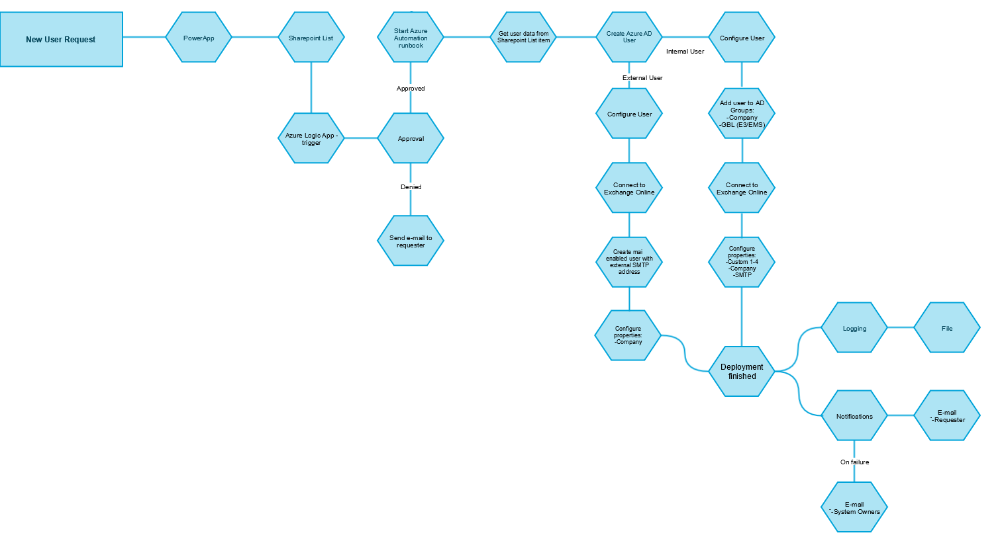

# Gather data and define workflow

As a rule of thumb in any automation project, define the workflow before doing anything.

If a formal workflow is not already in place, start by creating one based of the current manual processes for managing user accounts.

Then create a flow chart using your favorite tool (Visio, Gliffy, or others). Here is an example flow chart for a user onboarding process:

Next, define the following in a structured way (Excel, Csv, database, etc):

- Metadata about the the organization
    - Companies
    - Departments
- Which Active Directory groups new users should be added to
- Which applications new users should be provisioned in
    - Verify whether all required applications supports automated provisioning, either via group membership or an API

The gathered data will be leveraged in the next step, [Establish infrastructure](/05%20-%20infrastructure.md)